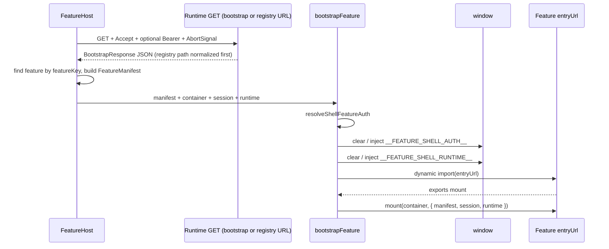

# Platform shell development guide

This guide explains how the **platform shell** discovers features, validates **bootstrap** payloads, maps them to a **feature manifest**, resolves **shell auth**, exposes a stable **`window`** contract to remote bundles, and **mounts** feature frontends. It is the deep companion to the repository [README](./README.md).

---

## Table of contents

1. [Concepts](#concepts)
2. [End-to-end architecture](#end-to-end-architecture)
3. [Shell session (React)](#shell-session-react)
4. [Path A: Bootstrap response → `FeatureHost`](#path-a-bootstrap-response--featurehost)
5. [Bootstrap HTTP contract and validation](#bootstrap-http-contract-and-validation)
6. [Mapping bootstrap rows to `FeatureManifest`](#mapping-bootstrap-rows-to-featuremanifest)
7. [Path B: Standalone manifest URL](#path-b-standalone-manifest-url)
8. [`bootstrapFeature`: mount pipeline](#bootstrapfeature-mount-pipeline)
9. [Auth resolution (`resolveShellFeatureAuth`)](#auth-resolution-resolveshellfeatureauth)
10. [`window.__FEATURE_SHELL_AUTH__` (v1)](#window__feature_shell_auth__-v1)
11. [Feature bundle contract](#feature-bundle-contract)
12. [UI lifecycle and `FeatureHost` behavior](#ui-lifecycle-and-featurehost-behavior)
13. [Errors, cookies, and CORS](#errors-cookies-and-cors)
14. [Code map (expanded)](#code-map-expanded)

---

## Concepts

| Term | Meaning |
|------|---------|
| **Shell** | This React app: owns layout, session context, and the DOM node where features mount. |
| **Bootstrap response** | JSON from a platform URL listing environment, user, permissions, flags, and a **`features`** array. Each row describes one deployable feature (routes, frontend entry URL, backend API base, optional auth hints). |
| **Feature manifest** | `FeatureManifest`: the shape the mount pipeline consumes (auth block, `frontend.entryUrl`, `mountFunction`, etc.). |
| **Remote feature** | A separate JS bundle loaded via **`import(entryUrl)`**, expected to export a **mount** function. |

The shell keeps **bootstrap discovery** (registry-style list) separate from **mount mechanics** (`bootstrapFeature`), so you can swap how manifests are obtained without changing import/mount logic.

---

## End-to-end architecture

**Path B** (not shown): callers pass **`manifestUrl`** into **`bootstrapFeature`** instead of an inline manifest; **`loadFeatureManifest`** fetches JSON, then the same pipeline runs from **`resolveShellFeatureAuth`** onward.

---

## Shell session (React)

**`ShellUserSession`** is provided by **`ShellAuthProvider`** (`src/app/providers/ShellAuthProvider.tsx`). **`useShellSession`** reads that context.

**Session shape** (`src/platform/auth/sessionTypes.ts`):

| Field | Role |
|-------|------|
| `isAuthenticated` | Whether the shell considers the user signed in. |
| `userId`, `userName`, `email` | Identity for UI and for **`resolveShellFeatureAuth`** / **`mount`** context. |
| `roles` | Role list. |
| `accessToken` | Used for **`buildRuntimeRequestHeaders()`** (Bearer) and passed through **`mount`**; window **`accessToken`** for features follows **`resolveShellFeatureAuth`** rules (**`tokenForwarding`**, etc.). |

**`App.tsx`** builds the session in two ways: **`MockShellApp`** (static dev user + **`VITE_MOCK_ACCESS_TOKEN`**) or **`EntraShellApp`** (MSAL **`acquireTokenSilent`** for **`VITE_ENTRA_SCOPES`**). **`main.tsx`** initializes MSAL and wraps **`App`** with **`MsalProvider`**.

**`FeatureHost`** mirrors the React session into **`setShellSessionSnapshot`** whenever **`sessionKey`** changes so runtime **`fetch`** calls see the same token as the UI.

---

## Path A: Runtime response → `FeatureHost`

`FeatureHost` (`src/app/pages/FeatureHost.tsx`):

1. **`loadRuntimeFeatures({ bootstrapUrl, signal })`** — **`bootstrapUrl`** defaults from **`getBootstrapUrl()`** via **`App`**; **`signal`** aborts in-flight loads. In **bootstrap** mode this calls **`loadBootstrapResponse`**: **`GET`** with **`Accept: application/json`**, optional **`Authorization`**, **`assertBootstrapResponse`** on JSON. In **registry** mode it uses **`loadRegistryRuntimeResponse`** + **`normalizeRegistryRuntimeResponse`** (see `loadRuntimeFeatures.ts`).
2. **`features.find(…)`** — if missing, throws *Feature '…' not found in bootstrap response*.
3. Builds **`FeatureManifest`** via **`normalizeManifestAuth`** (see [mapping table](#mapping-bootstrap-rows-to-featuremanifest)).
4. Calls **`bootstrapFeature({ manifest, container, session, runtime })`** with a constructed **`ShellFeatureRuntimeContractV1`** (flags, permissions, backend, etc.).

**`bootstrapUrl`** and **`featureKey`** are props from **`App`**. A derived **`sessionKey`** (auth + identity + token fields) re-runs the load effect when the session changes; **`AbortController`** cancels stale requests.

---

## Bootstrap HTTP contract and validation

### Request behavior

`loadBootstrapResponse` (`src/platform/bootstrap/loadBootstrapResponse.ts`):

- **`fetch(url, { method: "GET", headers: buildRuntimeRequestHeaders(), signal })`** — no **`credentials: "include"`** by default; Bearer comes from **`getShellSessionSnapshot()`** when set.
- Throws if **`!response.ok`** with status in the message.
- Parses JSON and runs **`assertBootstrapResponse(data)`** before returning **`BootstrapResponse`**.

`loadRegistryRuntimeResponse` uses the same header pattern and supports **`AbortSignal`** as well.

### Top-level shape

Validated by **`assertBootstrapResponse`** (`src/platform/contracts/assertBootstrapResponse.ts`):

| Field | Rule |
|-------|------|
| Root | Must be a non-null object. |
| `environment` | Non-empty string. |
| `user` | Object with **`id`** and **`displayName`** strings (optional **`email`** in the type; assertion only requires id + displayName). |
| `permissions` | Array of strings. |
| `flags` | Object whose values are all **booleans**. |
| `features` | Array; **each element** must satisfy **`assertFeature`**. |
| `metadata` | Object with **`source`** string (optional **`generatedBy`** in types). |

### Per-feature (`BootstrapFeature`) rules

Each feature entry must have:

| Field | Rule |
|-------|------|
| `featureKey` | Non-empty string. |
| `displayName` | Non-empty string. |
| `route` | Non-empty string **starting with `/`**. |
| `version` | Non-empty string. |
| `nav` | Object with **`label`** and **`icon`** strings. |
| `frontend` | Object with non-empty **`entryUrl`** string. |
| `backend` | Object with non-empty **`apiBaseUrl`** string. |
| `authorization` | Object with **`requiredPermissions`** and **`requiredFlags`** as **string arrays**. |

**`auth`** is optional on each feature; **`FeatureHost`** always calls **`normalizeManifestAuth(feature.auth)`**, which applies the same defaults as the table when **`auth`** is missing.

Types live in **`src/platform/contracts/bootstrapResponse.ts`**.

---

## Mapping bootstrap rows to `FeatureManifest`

`FeatureHost` maps a **`BootstrapFeature`** to **`FeatureManifest`** as follows:

| `FeatureManifest` field | Source |
|-------------------------|--------|
| `featureKey` | `feature.featureKey` |
| `displayName` | `feature.displayName` |
| `basePath` | `feature.route` |
| `version` | `feature.version` |
| `frontend.enabled` | `true` |
| `frontend.entryUrl` | `feature.frontend.entryUrl` |
| `frontend.mountFunction` | `feature.frontend.mountFunction` or the string `"mount"` if omitted |
| `backend.enabled` | `true` |
| `backend.baseUrl` | `feature.backend.apiBaseUrl` |
| `auth` | `feature.auth` or **defaults** (see below) |

**Default `auth` when `feature.auth` is missing** (same object `FeatureHost` uses):

- `required: false`
- `mode: "none"`
- `shellAuthRequired: false`
- `tokenForwarding: false`
- `tokenStrategy: "none"`
- `allowedDevModes: ["none", "mock"]`
- `roles: []`

So bootstrap rows without **`auth`** do **not** inject shell auth unless you add an **`auth`** block with **`shellAuthRequired: true`**.

Full **`FeatureManifest`** / **`FeatureManifestAuth`** field meanings are in **`src/platform/contracts/featureManifest.ts`**.

---

## Path B: Standalone manifest URL

`bootstrapFeature` also accepts **`manifestUrl`** (`src/platform/bootstrap/bootstrapFeature.ts`):

- **`loadFeatureManifest(url)`** (`src/platform/registry/loadFeatureManifest.ts`) performs a plain **`fetch(url)`** (no special headers; **no** `credentials: "include"` in the current implementation).
- Response JSON is cast to **`FeatureManifest`** — there is **no** runtime schema assertion for manifest URLs today.

Use this path when a feature is loaded outside the bootstrap registry flow (e.g. internal tools passing a known manifest URL). The mount and auth steps are identical once **`manifest`** is resolved.

---

## `bootstrapFeature`: mount pipeline

Implementation: **`src/platform/bootstrap/bootstrapFeature.ts`**.

| Step | What happens |
|------|----------------|
| 1 | Resolve **`manifest`**: inline **`manifest`**, else **`loadFeatureManifest(manifestUrl)`**, else throw. |
| 2 | **`shellAuth = resolveShellFeatureAuth(manifest, session)`** — may be `undefined`. |
| 3 | **`clearFeatureShellAuth()`**. |
| 4 | If **`shellAuth`**: strip **`version`**, **`injectFeatureShellAuth(authForWindow)`** (injector sets **`version: "v1"`** on **`window`**). |
| 5 | Build **`resolvedRuntime`** from **`runtime`** param or defaults from manifest. |
| 6 | **`clearFeatureShellRuntime()`** then **`injectFeatureShellRuntime(resolvedRuntime)`**. |
| 7 | Require **`manifest.frontend.entryUrl`** or throw. |
| 8 | **`import(/* @vite-ignore */ entryUrl)`** (or **`globalThis.__dynamicImportForTest__`** in tests). |
| 9 | Resolve **`mountFunctionName`** = **`manifest.frontend.mountFunction || "mount"`**; call **`mount(container, { manifest, session, runtime: resolvedRuntime })`**. |
| 10 | Return **`mount`**’s return value (**`unknown`** — **`FeatureHost`** may use a function as cleanup). |

**`session`** is the same **`ShellUserSession`** passed from **`FeatureHost`** (from React context).

---

## Auth resolution (`resolveShellFeatureAuth`)

**File:** `src/platform/auth/resolveShellFeatureAuth.ts`.

Returns **`undefined`** when:

- **`manifest.auth`** is missing, or
- **`manifest.auth.shellAuthRequired`** is **false**, or
- **`auth.mode`** is not handled (falls through — effectively **undefined** for unexpected modes).

When **`shellAuthRequired`** is **true**, behavior depends on **`auth.mode`**:

### `none`

Always returns a v1 contract with **`isAuthenticated: true`**, fixed **`userId` / `userName`**: `"anonymous"`, empty **`roles`**. Does not read **`session`** for identity.

### `mock`

Returns **`isAuthenticated: true`** and fills identity from **`session`** with dev-friendly fallbacks:

- `userId` → `session.userId ?? "dev-user"`
- `userName` → `session.userName ?? "Local Dev User"`
- `email` → `session.email ?? "dev@example.local"`
- `roles` → `session.roles ?? ["developer"]`
- `accessToken` → `session.accessToken` (passed through if present)

### `entra`

1. If **`!session.isAuthenticated`**: returns **`isAuthenticated: false`**, empty **`roles`** (minimal contract).
2. If **`auth.tokenForwarding`** is true **and** **`session.accessToken`** is missing: returns **`isAuthenticated: false`** but includes **`userId`**, **`userName`**, **`email`**, **`roles`** from session (so the feature can show “signed in but no token”).
3. Otherwise returns **`isAuthenticated: true`** with full identity fields; **`accessToken`** is set **only** when **`auth.tokenForwarding`** is true (otherwise **`accessToken`** is omitted from the success object).

---

## `window.__FEATURE_SHELL_AUTH__` (v1)

**Type:** `ShellFeatureAuthContractV1` in **`src/platform/contracts/shellFeatureAuth.ts`**.

| Field | Notes |
|-------|--------|
| `version` | Always **`"v1"`** at runtime (injection wraps the object). |
| `isAuthenticated` | Drives gated UI in the feature bundle. |
| `userId`, `userName`, `email` | Optional identity fields depending on mode and entra branches. |
| `roles` | Defaults to **`[]`** in **`injectFeatureShellAuth`** if omitted. |
| `accessToken` | Optional; entra may omit it when **`tokenForwarding`** is false or when forcing unauthenticated branches. |

**Injection** (`src/platform/auth/injectFeatureShellAuth.ts`): assigns **`window.__FEATURE_SHELL_AUTH__`**; **`clearFeatureShellAuth`** uses **`delete`**.

Feature bundles should treat the global as **best-effort**: read it **after** the mount chunk loads and avoid caching a stale pointer across shell navigations without re-reading.

---

## Feature bundle contract

Remote entries loaded from **`manifest.frontend.entryUrl`** must:

1. Be valid ES modules reachable by the browser (correct **CORS** for cross-origin `import()`).
2. Export **`mount`** (or **`manifest.frontend.mountFunction`**).
3. Accept **`mount(container, { manifest, session, runtime })`** where **`runtime`** is **`ShellFeatureRuntimeContractV1`**.

Return **`unknown`**; if you return a **function**, **`FeatureHost`** treats it as **cleanup** when the load is aborted or the host unmounts.

---

## UI lifecycle and `FeatureHost` behavior

- **`useEffect`** depends on **`[bootstrapUrl, featureKey, sessionKey]`** where **`sessionKey`** encodes auth + identity + token fields — session changes trigger a reload.
- **`AbortController`** aborts the runtime **`fetch`** when the effect cleans up or a newer load starts; **`AbortError`** is ignored in **`catch`**.
- **`replaceChildren()`** clears the container before each load; **`runCleanup`** invokes the prior **`mount`** cleanup function when present.
- **`cancelled`** / **`loadIdRef`** guard against applying stale results after unmount or superseded loads.

---

## Errors, cookies, and CORS

| Situation | Typical outcome |
|-----------|------------------|
| Bootstrap HTTP non-2xx | Error from **`loadBootstrapResponse`**. |
| Invalid JSON shape | **`assertBootstrapResponse`** throws with a specific message. |
| Feature key missing | **`FeatureHost`** throws *not found in bootstrap response*. |
| Frontend disabled / missing `entryUrl` | **`bootstrapFeature`** throws. |
| Remote bundle missing export | **`bootstrapFeature`** throws *does not export mount function*. |
| Cross-origin **`entryUrl`** | Browser **`import()`** requires **CORS** on the script URL; failures surface as load errors. |
| Aborted fetch | **`AbortSignal`** from **`FeatureHost`**; **`loadRuntimeFeatures`** / **`fetch`** reject with **`AbortError`**, handled silently. |

---

## Code map (expanded)

| Topic | Location |
|-------|----------|
| App shell (mock / Entra), navigation | `src/app/App.tsx` |
| MSAL bootstrap | `src/main.tsx` |
| Bootstrap → manifest → mount | `src/app/pages/FeatureHost.tsx` |
| Session context | `src/app/providers/ShellAuthProvider.tsx`, `src/app/hooks/useShellSession.ts` |
| Runtime mode + URLs | `src/platform/runtime/runtimeClientConfig.ts`, `loadRuntimeFeatures.ts` |
| Fetch + validate bootstrap | `src/platform/bootstrap/loadBootstrapResponse.ts`, `assertBootstrapResponse.ts` |
| Registry fetch + normalize | `loadRegistryRuntimeResponse.ts`, `normalizeRegistryRuntimeResponse.ts` |
| Mount orchestration | `src/platform/bootstrap/bootstrapFeature.ts` |
| Manifest fetch (URL path) | `src/platform/registry/loadFeatureManifest.ts` |
| Auth resolution | `src/platform/auth/resolveShellFeatureAuth.ts` |
| Window injection | `injectFeatureShellAuth.ts`, `injectFeatureShellRuntime.ts` |
| Session snapshot for `fetch` | `src/platform/session/shellSessionStore.ts`, `runtimeRequestAuth.ts` |
| MSAL config | `src/platform/auth/msalConfig.ts` |
| Session type | `src/platform/auth/sessionTypes.ts` |
| Types: bootstrap / manifest / window contract | `bootstrapResponse.ts`, `featureManifest.ts`, `shellFeatureAuth.ts`, `registryRuntimeResponse.ts` |
| Tests (examples) | `bootstrapFeature.test.ts`, `bootstrapFeatureAuth.integration.test.ts`, `FeatureHost.test.tsx`, `loadRuntimeFeatures.test.ts` |

---

## Related reading

- [README](./README.md) — setup, scripts, high-level runtime flow  
- [docs/platform.md](./docs/platform.md) — platform architecture  
- [docs/runtime-auth-contract-v1.md](./docs/runtime-auth-contract-v1.md) — v1 globals and mount context  
- [docs/local-runtime-modes.md](./docs/local-runtime-modes.md) — env and verification
