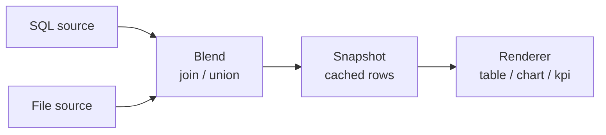

# Report Builder — Guide

The builder turns a **data source** (a SQL query and/or an uploaded spreadsheet)
plus **display metadata** into a slug-routed report, rendered by a shared,
consistent renderer (tables, charts, KPI cards). Viewers never read live data —
they read the latest cached **snapshot**, taken when you publish or refresh.

> This is the out-of-app copy of the in-app **Guide** tab (`#/help`). They cover
> the same ground; edit both when the builder changes.

## Contents

1. [How the builder works](#1-how-the-builder-works)
2. [Title, description & slug](#2-title-description--slug)
3. [Data sources (SQL & files)](#3-data-sources-sql--files)
4. [Combining sources (join / union)](#4-combining-sources-join--union)
5. [Outputs](#5-outputs)
6. [Columns](#6-columns)
7. [Parameters](#7-parameters)
8. [Chart](#8-chart)
9. [Page layout](#9-page-layout)
10. [Access groups](#10-access-groups)
11. [Preview & publish](#11-preview--publish)
12. [Worked example](#12-worked-example)
13. [Common recipes](#13-common-recipes)
14. [Full JSON reference](#14-full-json-reference)
15. [Advanced JSON cheatsheet](builder-json-cheatsheet.md) — dense one-page field reference

---

## 1. How the builder works

The builder is a split view: the **form** on the left, a **live preview** on the
right. As you define columns and a chart, the preview composes the report from
sample data. Click **Preview data** to run a real dry-run against your sources —
the preview then shows actual columns and rows (badge flips to "real data") and
nothing is saved. Publishing creates the report and takes an immediate snapshot;
editing and saving re-runs it.



Sources are blended into one cached snapshot; viewers read the snapshot, never
live data.

---

## 2. Title, description & slug

| Attribute | Type / values | What it does |
|---|---|---|
| `title` | string (required) | Display name. On create the `slug` is derived from it (`Active Policies by Region` → `active-policies-by-region`). |
| `description` | string | Short subtitle shown on the report and browse card. |
| `slug` | string | URL identity. Auto-derived; stays stable when you edit so links keep working. |
| `status` | `active` \| `draft` \| `archived` | `active` shows in Browse; `draft` is author-only; `archived` is hidden. |

---

## 3. Data sources (SQL & files)

A report gets its rows one of two ways — **Single SQL query** (legacy), or
**Multiple sources / files** that are blended. Toggle at the top of the Data
source section.

### SQL sources

SQL must be a single **read-only** query:

- Starts with `SELECT` or `WITH … SELECT`.
- Exactly one statement (no semicolon-chained statements).
- Disallowed keywords are rejected: `insert, update, delete, merge, drop, alter,
  create, truncate, grant, revoke, call, exec, copy, use, set, begin, commit`, …
- Reference parameters as `:name` and declare them (see [Parameters](#7-parameters)).

### File sources (CSV / XLSX)

Choose **File** on a source and upload a spreadsheet. It's parsed immediately:
columns and formats are inferred and a `file_ref` is stored. The file *is* the
data — a file source shows the same rows in local and live mode.

| Attribute | Type / values | What it does |
|---|---|---|
| `name` | string (required) | Stable handle used by the combine spec (e.g. `policies`). |
| `type` | `sql` \| `file` | Which kind of source this is. |
| `sql` | string | The read-only SELECT (SQL sources). |
| `file_ref` | string | Handle to an uploaded dataset (file sources). |
| `params` | object | Per-source bound params (same shape as report params). |

**Upload limits:** `.csv` / `.xlsx` only, ≤ 10 MB, ≤ 50,000 rows, ≤ 200 columns.

---

## 4. Combining sources (join / union)

With two or more sources you must choose how to combine them. Blending happens
in-process, so you can mix SQL and file sources freely.

```text
policies(id, premium)  ⨝ join on id ⨝  claims(id, paid)   →  blended(id, premium, paid)
east(region, n)         ∪ union ∪        west(region, n)    →  stacked(region, n)  (all rows)
```

### Join

Merge sources on matching key columns. Add one join per pair; joins apply
left-to-right, so a third source chains onto a source already used.

| Attribute | Type / values | What it does |
|---|---|---|
| `op` | `"join"` | Selects join mode. |
| `joins[]` | array | One or more join steps. |
| `joins[].left` / `.right` | source name | The two sources being joined. |
| `joins[].on` | `[[left_col, right_col], …]` | Key pairs to match on. Same-named keys collapse to one column; differing names keep both. |
| `joins[].how` | `inner` \| `left` | `inner` keeps only matches; `left` keeps all left rows (missing right cells → null). |

```json
"combine": {
  "op": "join",
  "joins": [
    { "left": "policies", "right": "claims",
      "on": [["policy_id", "policy_id"]], "how": "left" }
  ]
}
```

### Union

Stack sources with compatible columns end-to-end.

| Attribute | Type / values | What it does |
|---|---|---|
| `op` | `"union"` | Selects union mode. |
| `distinct` | boolean | When true, drops fully-duplicate rows after stacking. |

```json
"combine": { "op": "union", "distinct": true }
```

Column-name collisions on a join are suffixed with the right source name
(e.g. `amount_claims`).

---

## 5. Outputs

`output_types` chooses which renderer surfaces appear when no page
[layout](#9-page-layout) is set:

| Value | What it does |
|---|---|
| `"table"` | Data grid with formats, bars, heat, badges, summary strip. |
| `"chart"` | A chart from the chart config. |
| `"kpi"` | KPI cards derived from summary aggregates. |

---

## 6. Columns

The columns map (`{ column_key: { … } }`) configures how each result column
renders. Keys match the columns your query/file returns. Basic fields are in the
structured editor; the "hints" are available in **Advanced (raw JSON)**.

| Attribute | Type / values | What it does |
|---|---|---|
| `label` | string | Header text (defaults to the column key). |
| `format` | `int` \| `float` \| `currency` \| `percent` \| `date` \| `datetime` \| `text` | How values are formatted. |
| `align` | `left` \| `right` \| `center` | Cell alignment. |
| `hidden` | boolean | Keep the column in data but hide it from the table. |
| `agg` | `sum` \| `avg` \| `min` \| `max` \| `count` | Aggregate in the summary strip and used for KPI cards. |
| `bar` | boolean | Inline magnitude bar behind numeric values. |
| `heat` | `true` \| `"reverse"` | Traffic-light color scale (high = good; `reverse` flips). |
| `style` | `"badge"` | Render values as colored pills. |
| `group` | string | Column-group band label (e.g. group columns under "Location"). |

```json
"columns": {
  "region":  { "label": "Region", "group": "Location" },
  "premium": { "label": "Premium", "format": "currency",
               "align": "right", "agg": "sum", "bar": true },
  "loss_ratio": { "label": "Loss ratio", "format": "percent", "heat": "reverse" },
  "tier": { "label": "Tier", "style": "badge" }
}
```

---

## 7. Parameters

Bound values referenced as `:name` in SQL (never string-interpolated). Declare
each one you reference; `default` is used when a caller doesn't supply a value.

| Attribute | Type / values | What it does |
|---|---|---|
| `type` | `string` \| `int` \| `float` \| `bool` \| `date` | Value type. |
| `label` | string | Friendly name for UI. |
| `default` | any | Value used when none is provided. |
| `required` | boolean | Whether a value must be supplied. |

```json
"params": {
  "status": { "type": "string", "label": "Policy status", "default": "active" },
  "since":  { "type": "date", "required": true }
}
```

Referencing `:status` without declaring it is rejected with a clear error.

---

## 8. Chart

| Attribute | Type / values | What it does |
|---|---|---|
| `type` | `bar` \| `line` \| `pie` \| `area` | Chart kind. |
| `x` | column key | Category / x-axis column. |
| `y` | column key \| array | One or more measure columns (y-series). |
| `series` | column key | Optional column to split into multiple series. |
| `agg` | `sum` \| `avg` | How to combine rows sharing an x value (default `sum`). |

```json
"chart": { "type": "bar", "x": "region", "y": ["premium", "claims"], "agg": "sum" }
```

---

## 9. Page layout

Optionally compose the page into blocks on a 12-column grid. When a layout is
present it overrides `output_types`.

| Attribute | Type / values | What it does |
|---|---|---|
| `type` | `kpi` \| `chart` \| `table` \| `note` | What the block renders. |
| `span` | 1–12 | Grid width (12 = full row). |
| `title` | string | Optional block heading. |
| `chart` | chart config | Required when `type` is `chart` (same shape as §8). |
| `text` | string | Text, used when `type` is `note`. |

```json
"layout": [
  { "type": "kpi", "span": 12 },
  { "type": "chart", "span": 8, "title": "By region",
    "chart": { "type": "bar", "x": "region", "y": "premium" } },
  { "type": "table", "span": 4, "title": "Detail" }
]
```

---

## 10. Access groups

`access_groups` is a list of app-managed group slugs allowed to view the report.
Leave empty to make it visible to all viewers. Groups are managed by admins;
membership is by user key (oid or email).

```json
"access_groups": ["underwriting", "exec"]
```

---

## 11. Preview & publish

- **Preview data** runs a dry-run (bounded to ~50 rows) against your current
  sources and metadata. Persists nothing; surfaces validation errors (bad SQL,
  undeclared params, missing file) inline.
- **Publish / Save changes** validates, stores the definition, and takes a fresh
  snapshot immediately so the report is viewable at once.
- Leaving the builder with unsaved edits asks for confirmation.

---

## 12. Worked example

Build a **Premiums vs Claims by region** report from a SQL query and an uploaded
claims spreadsheet.

1. **Open the builder** (Upload tab) and set title `Premiums vs Claims` → slug
   `premiums-vs-claims`.
2. Under **Data source**, choose **Multiple sources / files**. Rename the first
   source `policies`, keep type **SQL**, enter:
   ```sql
   SELECT region, policy_id, premium FROM policies
   ```
3. **+ Add source**, name it `claims`, switch to **File**, upload `claims.csv`
   (columns `policy_id, paid`). Inferred columns show on the card.
4. In the **Combine** box, pick **join**, set `policies` **left join** `claims`,
   add key pair `policy_id = policy_id`.
5. In **Columns**, set `premium` → currency + `agg: sum` + bar; `paid` → currency
   + `agg: sum`. In **Chart**, enable bar, x = `region`, y = `premium` and `paid`.
6. **Preview data** — the right pane shows real blended rows/columns. Fix any
   errors it surfaces.
7. **Publish** — a snapshot is taken and you land on the finished report.

Resulting definition:

```json
{
  "title": "Premiums vs Claims",
  "sources": [
    { "name": "policies", "type": "sql",
      "sql": "SELECT region, policy_id, premium FROM policies" },
    { "name": "claims", "type": "file", "file_ref": "<uploaded claims.csv>" }
  ],
  "combine": {
    "op": "join",
    "joins": [{ "left": "policies", "right": "claims",
                "on": [["policy_id", "policy_id"]], "how": "left" }]
  },
  "columns": {
    "region":  { "label": "Region" },
    "premium": { "label": "Premium", "format": "currency", "agg": "sum", "bar": true },
    "paid":    { "label": "Claims paid", "format": "currency", "agg": "sum" }
  },
  "chart": { "type": "bar", "x": "region", "y": ["premium", "paid"] },
  "output_types": ["kpi", "chart", "table"]
}
```

---

## 13. Common recipes

### Grouped aggregate (single query)

```json
{
  "title": "Active Policies by Region",
  "sql_text": "SELECT region, COUNT(*) AS n FROM policies WHERE status = :status GROUP BY region",
  "params": { "status": { "type": "string", "default": "active" } },
  "columns": { "region": { "label": "Region" },
               "n": { "label": "Count", "format": "int", "agg": "sum", "bar": true } },
  "chart": { "type": "bar", "x": "region", "y": "n" }
}
```

### Enrich a query with an uploaded lookup file (join)

```json
{
  "title": "Policies with Agent Names",
  "sources": [
    { "name": "pol", "type": "sql", "sql": "SELECT agent_id, premium FROM policies" },
    { "name": "agents", "type": "file", "file_ref": "<agents.xlsx>" }
  ],
  "combine": { "op": "join",
    "joins": [{ "left": "pol", "right": "agents", "on": [["agent_id", "id"]], "how": "left" }] }
}
```

### Combine two regional extracts (union)

```json
{
  "title": "All Regions",
  "sources": [
    { "name": "east", "type": "file", "file_ref": "<east.csv>" },
    { "name": "west", "type": "file", "file_ref": "<west.csv>" }
  ],
  "combine": { "op": "union", "distinct": true }
}
```

### KPI-first dashboard layout

```json
{
  "title": "Book Overview",
  "sql_text": "SELECT region, premium, loss_ratio FROM book",
  "columns": {
    "premium": { "format": "currency", "agg": "sum" },
    "loss_ratio": { "format": "percent", "agg": "avg", "heat": "reverse" }
  },
  "layout": [
    { "type": "kpi", "span": 12 },
    { "type": "chart", "span": 7, "title": "Premium by region",
      "chart": { "type": "bar", "x": "region", "y": "premium" } },
    { "type": "table", "span": 5, "title": "Detail" }
  ]
}
```

### Heat-mapped performance table

```json
{
  "title": "Regional Performance",
  "sql_text": "SELECT region, retention, loss_ratio FROM perf",
  "columns": {
    "region": { "label": "Region", "group": "Location" },
    "retention": { "format": "percent", "heat": true, "group": "Performance" },
    "loss_ratio": { "format": "percent", "heat": "reverse", "group": "Performance" }
  }
}
```

---

## 14. Full JSON reference

```jsonc
{
  "title": "Blended Book",
  "description": "Premiums vs claims by region",
  "slug": "blended-book",          // optional; derived from title
  "status": "active",              // active | draft | archived

  // --- Data: EITHER a single query ...
  "sql_text": "SELECT region, COUNT(*) AS n FROM policies GROUP BY region",

  // --- ... OR multiple sources (omit sql_text):
  "sources": [
    { "name": "policies", "type": "sql",
      "sql": "SELECT region, id, premium FROM policies" },
    { "name": "claims", "type": "file", "file_ref": "<from upload>" }
  ],
  "combine": {
    "op": "join",                  // join | union
    "joins": [
      { "left": "policies", "right": "claims",
        "on": [["id", "policy_id"]], "how": "left" }
    ],
    "distinct": false              // union only
  },

  // --- Display metadata ---
  "columns": {
    "region":  { "label": "Region", "group": "Location" },
    "premium": { "label": "Premium", "format": "currency",
                 "align": "right", "agg": "sum", "bar": true },
    "loss_ratio": { "label": "Loss ratio", "format": "percent", "heat": "reverse" }
  },
  "params": {
    "status": { "type": "string", "label": "Status", "default": "active" }
  },
  "chart": { "type": "bar", "x": "region", "y": "premium", "agg": "sum" },
  "output_types": ["table", "chart", "kpi"],
  "layout": null,

  // --- Access ---
  "access_groups": ["underwriting"]
}
```

**Rules:** provide `sql_text` *or* `sources` (not both); `combine` is required with
2+ sources; source names must be unique; SQL must be a single read-only SELECT
with all `:params` declared.
